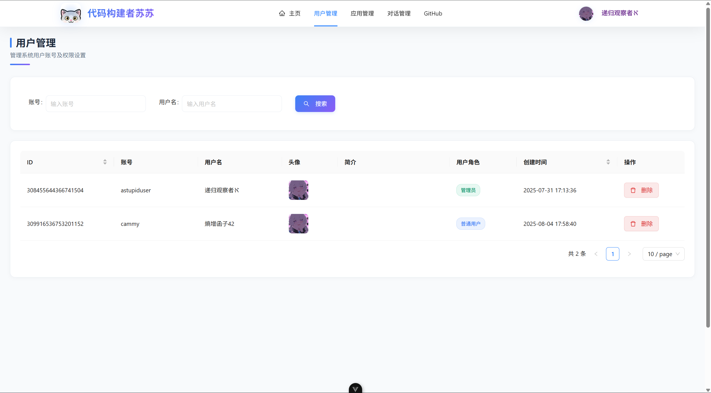
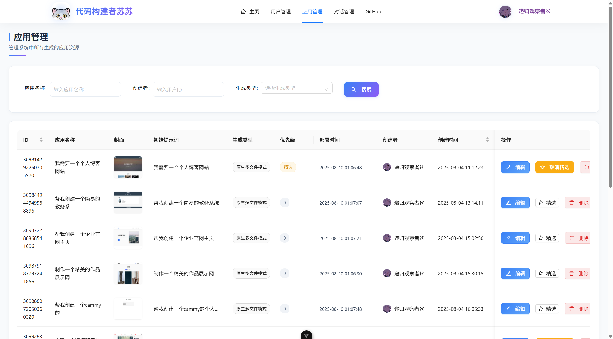
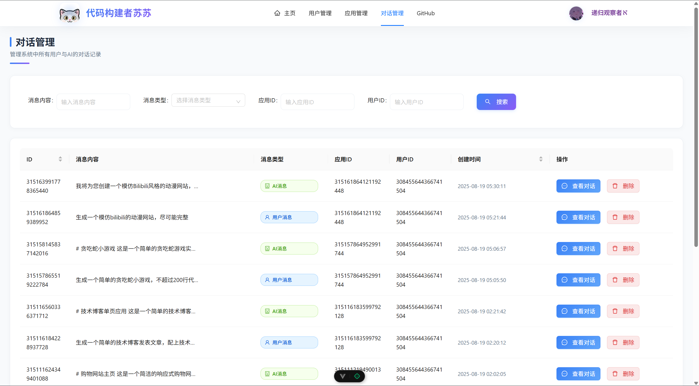
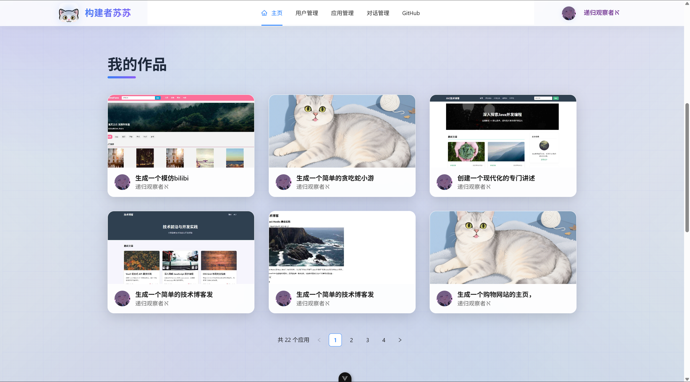
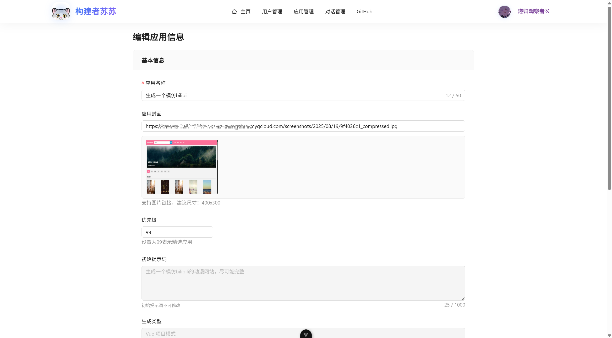

# Aether Builder: AI 代码生成器

Aether Builder 是一个功能强大的 AI 代码生成平台，旨在通过人工智能技术帮助开发者快速构建、编辑和部署应用程序。平台集成了先进的大语言模型和可视化编辑工具，让开发过程变得更加高效和直观。










## 核心能力

### 1. 智能代码生成

- 通过自然语言描述需求，AI 自动分析并选择合适的生成策略
- 支持多种编程语言和框架的代码生成
- 工具调用机制确保生成代码的准确性和实用性
- 流式输出让用户实时看到 AI 的执行过程

### 2. 可视化编辑

- 生成的应用实时预览和展示
- 交互式编辑模式，直接选择网页元素进行修改
- 与 AI 对话协作，快速迭代调整页面设计
- 所见即所得的编辑体验

### 3. 一键部署分享

- 应用一键部署到云端，无需复杂配置
- 自动截取应用封面图，提升分享吸引力
- 生成可公开访问的地址，方便团队协作和演示
- 支持完整项目源码下载，保留所有开发成果

### 4. 企业级管理

- 完善的用户管理系统，支持多角色权限控制
- 应用生命周期管理，从创建到部署的全流程追踪
- 系统监控和性能分析，确保服务稳定运行
- 业务指标监控，帮助团队了解应用使用情况
- 管理员可设置精选应用，展示优质内容

## 技术栈

### 前端

- **框架**: Vue 3
- **构建工具**: Vite
- **UI 组件库**: Ant Design Vue
- **状态管理**: Pinia
- **路由**: Vue Router
- **HTTP 客户端**: Axios
- **代码高亮**: highlight.js
- **Markdown 解析**: markdown-it

### 后端

- **框架**: Spring Boot 3
- **编程语言**: Java 21
- **ORM 框架**: MyBatis
- **缓存**: Redis
- **数据库**: MySQL
- **AI 集成**: LangChain4j
- **API 文档**: Knife4j OpenAPI 3

## 快速开始

### 环境准备

1. 安装 JDK 21
2. 安装 Node.js 18+
3. 安装 MySQL 和 Redis
4. 配置环境变量

### 运行后端

```bash
# 克隆项目
git clone https://github.com/Kim-op/aether_builder.git
cd aether_builder

# 配置数据库
# 修改 src/main/resources/application.properties 中的数据库连接信息

# 构建和运行
mvn clean install
mvn spring-boot:run
```

### 运行前端

```bash
cd aether_builder-frontend

# 安装依赖
npm install

# 运行开发服务器
npm run dev
```

### 访问应用

- 前端地址: http://localhost:5173
- 后端 API 文档: http://localhost:8956/doc.html

## 使用指南

### 1. 生成应用

- 在首页输入应用需求描述
- 选择应用类型和技术栈
- 点击「生成应用」按钮，等待 AI 完成代码生成
- 查看生成的应用预览

### 2. 编辑应用

- 点击「进入编辑」按钮，进入可视化编辑模式
- 选择页面元素，通过右侧面板修改属性
- 或与 AI 对话，描述想要的修改
- 实时查看修改效果

### 3. 部署应用

- 编辑完成后，点击「部署应用」按钮
- 等待部署完成，获取应用访问链接
- 可以分享链接给团队成员或客户
- 如需源码，点击「下载源码」按钮

### 4. 管理应用

- 登录管理员账号
- 进入「应用管理」页面，查看所有应用
- 可设置精选应用、删除应用或查看应用详情
- 进入「用户管理」页面，管理平台用户

## 项目结构

```
aether_builder/
├── aether_builder-frontend/  # 前端代码
│   ├── public/               # 静态资源
│   └── src/                  # 源代码
├── src/                      # 后端代码
│   ├── main/                 # 主代码
│   └── test/                 # 测试代码
├── pom.xml                   # Maven 配置
└── README.md                 # 项目说明
```

## 贡献指南

1. Fork 本项目
2. 创建特性分支 (`git checkout -b feature/fooBar`)
3. 提交修改 (`git commit -am 'Add some fooBar'`)
4. 推送到分支 (`git push origin feature/fooBar`)
5. 创建新的 Pull Request

## 许可证

本项目采用 MIT 许可证 - 详情请见 [LICENSE](LICENSE) 文件

## 联系我们

- 官方网站: 
- 邮箱: Agoni437@163.com
- GitHub: [https://github.com/Kim-op/aether_builder](https://github.com/Kim-op/aether_builder)
